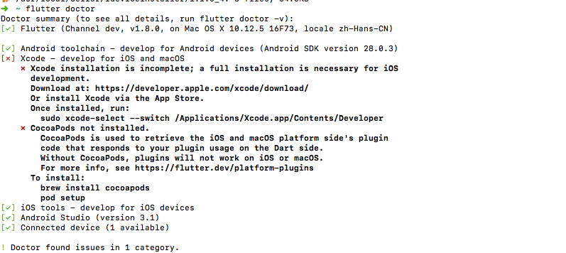
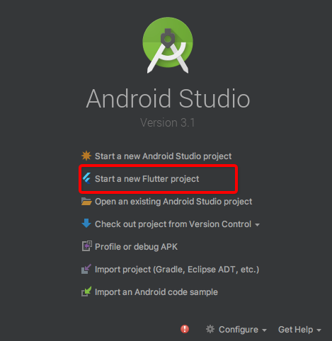

# Flutter 环境搭建
本文引自 **《缘起▪Flutter实战》https://book.flutterchina.club/**
本文仅总结自身遇到的问题和学习经验，如无帮助请另谋出路。

## 安装Flutter
### 获取Flutter SDK
1.Flutter官网下载最新可用安装包，官网地址：https://flutter.io/sdk-archive/#macos
2.也可以去Flutter github项目下去下载安装包，地址：https://github.com/flutter/flutter/releases 
> 
//1.将安装包zip解压到你想安装Flutter SDK的路径（如：C:\src\flutter；注意，不要将flutter安装到需要一些高权限的路径如C:\Program Files\）。
//2.在Flutter安装目录的flutter文件下找到flutter_console.bat，双击运行并启动flutter命令行，接下来，你就可以在Flutter命令行运行flutter命令了。  


3.本人使用方式：
> 
**//1.终端中输入以下指令克隆项目**
git clone -b beta https://github.com/flutter/flutter.git
**//2.导出到Flutter保存路径**
export PATH=`pwd`/flutter/bin:$PATH

### 配置环境变量
想要随便打开个终端窗口都能运行flutter命令，需要配置全局的环境变量

> 1.确认Flutter SDK的安装目录**FlutterSDKDir**。
> 2.打开环境变量文件`.base_profile`，文件位置自行百度，我的此文件就在运行ls命令的当前文件夹下面，注意此文件是隐藏文件，如想查看隐藏文件，请到文件夹下面用`shift+command+.`命令查看隐藏文件，前缀为`.`的都是隐藏文件。
> 3.vim .base_profile编辑该文件，i添加内容，添加 `export PATH=[FlutterSDKDir路径]/flutter/bin:$PATH`，按esc保存退出编辑模式，按:wq退出到命令窗口。
> 4.运行`source $HOME/.bash_profile` 刷新当前终端窗口,**在同一文档目录下时去掉$HOME/，运行source .bash_profile**。注意：如果你使用的终端是zsh，终端启动时~/.bash_profile 将不会被加载，解决办法就是修改 ～/.zshrc ，在其中添加：source ～/.bash_profile。
> 5.验证PATH是否配置成功，运行`echo $PATH`，查看是否由flutter字样的路径配置；或者打开新终端窗口，运行`flutter`命令，是否出现命令和Option介绍。

### 使用镜像
由于国内访问Flutter受限，Flutter官方为中国开发者搭建了临时镜像，可以将如下环境变量加入到用户环境变量中：
> `export PUB_HOSTED_URL=https://pub.flutter-io.cn`
> `export FLUTTER_STORAGE_BASE_URL=https://storage.flutter-io.cn`
> **注：在.bash_profile中添加，操作步骤参考配置环境变量那一步**

### 运行flutter doctor检查
> 终端运行`flutter doctor`命令查看Flutter所有依赖安装情况



> - `[√]` 表示依赖已经安装成功。
>- `[x]` 标识依赖尚未安装成功，按照图片里提示操作安装相应依赖就行。
> - 只想跑在Android模拟器上可以不下载XCode和iOS tools
> - 只想跑在IOS模拟器上也可以不下载Android toolchain和Android Studio
> - 剩下的依赖必须全部安装上

### Android Studio设置
> - -> Preferences
> -  -> Plugins
> -  -> Browse repositories
> - 搜索Flutter，Install即可

### Android Studio 运行第一个Flutter项目

Start a new Flutter project


一直next到finish即可，有默认案例项目


点击绿色运行按钮`报错`

``` gradle
Launching lib/main.dart on MI 4LTE in debug mode...
Initializing gradle...
Resolving dependencies...
Running Gradle task 'assembleDebug'...

FAILURE: Build failed with an exception.

* What went wrong:
Execution failed for task ':app:compileflutterBuildDebugArm'.
> A problem occurred starting process 'command '/Users/user/flutter/bin/flutter''

* Try:
Run with --stacktrace option to get the stack trace. Run with --info or --debug option to get more log output. Run with --scan to get full insights.

* Get more help at https://help.gradle.org

BUILD FAILED in 3s
Finished with error: Gradle task assembleDebug failed with exit code 1
```

问题纠缠好久，各种网上找资料也还没解决，但terminal运行`flutter run`能成功。
所以我怀疑是gradle配置等有问题，暂且不管，第一个flutter项目算是运行成功了，赞。

``` gradle
➜  flutter_app flutter run                         
Launching lib/main.dart on MI 4LTE in debug mode...
Initializing gradle...                                              1.2s
Resolving dependencies...                                          12.2s
Running Gradle task 'assembleDebug'...                                  
Running Gradle task 'assembleDebug'... Done                        19.0s
Built build/app/outputs/apk/debug/app-debug.apk.
Installing build/app/outputs/apk/app.apk...                        15.1s
Syncing files to device MI 4LTE...                                      
 3,073ms (!)                                       

🔥  To hot reload changes while running, press "r". To hot restart (and rebuild state), press "R".
An Observatory debugger and profiler on MI 4LTE is available at: http://127.0.0.1:57972/8Me-psE2taQ=/
For a more detailed help message, press "h". To detach, press "d"; to quit, press "q".
```

当代码有修改想预览效果时，按照提示按`r`和`R`操作就行，非常方便，效果立马预览出来。
退出APP再次进入修改效果不会保留，只有重新运行才能最终保留修改效果，上述只用于预览。

